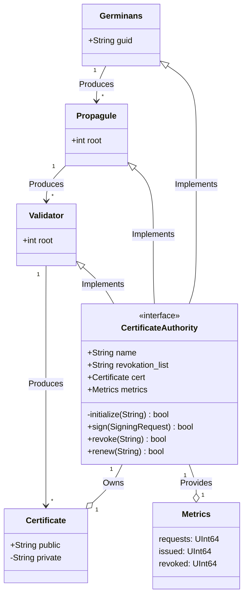

# 🌱 Avicennia Germinans
<a href="https://algokit.io"></a>
[]()

> [!CAUTION]
> This project is not intended for production use. Use at your own risk.

Extending on the work of Hashicorp's Vault PKI backend, this project aims to provide a Root CA, Intermediary CA and End Entity Certificates for Algorand Blockchain. The Root CA is self-signed and the Intermediary CA is signed by the Root CA. The End Entity Certificates are signed by the Intermediary CA.

### Why Avicennia Germinans?

This project is named after the Black Mangrove, a species of mangrove tree that is native to the Americas.
The Black Mangrove is known for its ability to grow in saltwater and is often found in coastal areas.
The Black Mangrove is a pioneer species, meaning it is one of the first species to colonize an area.
This project aims to be the first to colonize the Algorand Blockchain with a Certificate Authority.

### Why a Certificate Authority?

A Certificate Authority is a trusted entity that issues digital certificates.
Certificates are based on the [x.509 standard](https://datatracker.ietf.org/doc/html/rfc5280) and are used in many applications, including TLS/SSL, VPNs, and code signing.
Following in the footsteps of [Let's Encrypt](https://letsencrypt.org/), this project aims to provide free certificates to the Algorand community.


## 🎉 Getting Started

Bootstrap all the project dependencies by running the following command:

```bash
algokit boostrap all
algokit project run build
```

Navigate to http://localhost:8200 to view the vault UI and Certificate Authority.

## 📚 TODO:

- [ ] Define REST/RPC interface for Certificate Authority (possibly hijack hashicorp vault's PKI backend via a plugin)
- [ ] Define REST/RPC interface for Validator (see certbot for inspiration, also possibly a plugin)
- [ ] Bind the PKI state to the Algorand Blockchain using the CertificateAuthority smart contract

## 🏗️ Class Diagram

