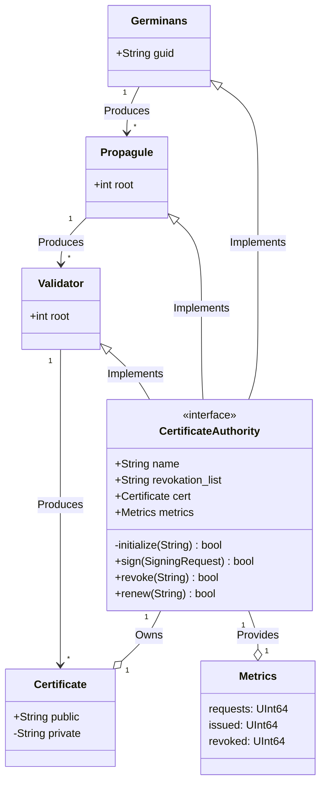

# 🌱 Avicennia Germinans
<a href="https://algokit.io"></a>
[]()

> [!CAUTION]
> This project is not intended for production use. Use at your own risk.

Extending on the work of Hashicorp's Vault PKI backend, this project aims to provide a Root CA, Intermediary CA and End Entity Certificates for Algorand Blockchain. The Root CA is self-signed and the Intermediary CA is signed by the Root CA. The End Entity Certificates are signed by the Intermediary CA.

## 🎉 Getting Started

Bootstrap all of the project dependencies by running the following command:

```bash
algokit boostrap all
algokit project run build
```

## 🏗️ Class Diagram

