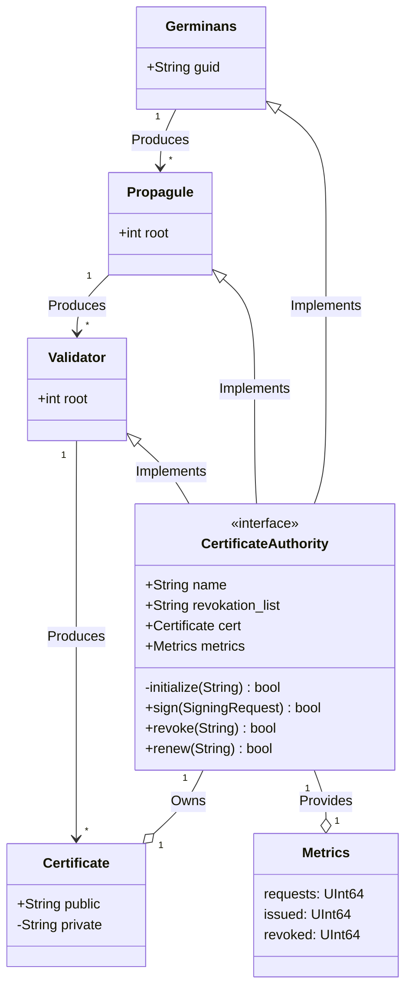

# 🌱 Avicennia

> [!CAUTION]
> This project is not intended for production use. Use at your own risk.
 
Smart contracts library for integrating a Certificate Authority(CA) with the Algorand Blockchain.

## Why Avicennia?

Traditional Public Key Infrastructure(PKI) systems rely on a centralized Certificate Authority(CA) to issue and manage digital certificates. 
This centralization creates a single point of failure and a potential security risk. 
By leveraging the Algorand blockchain, we can create a decentralized PKI system that is more secure and reliable.

## 🏗️ Class Diagram

